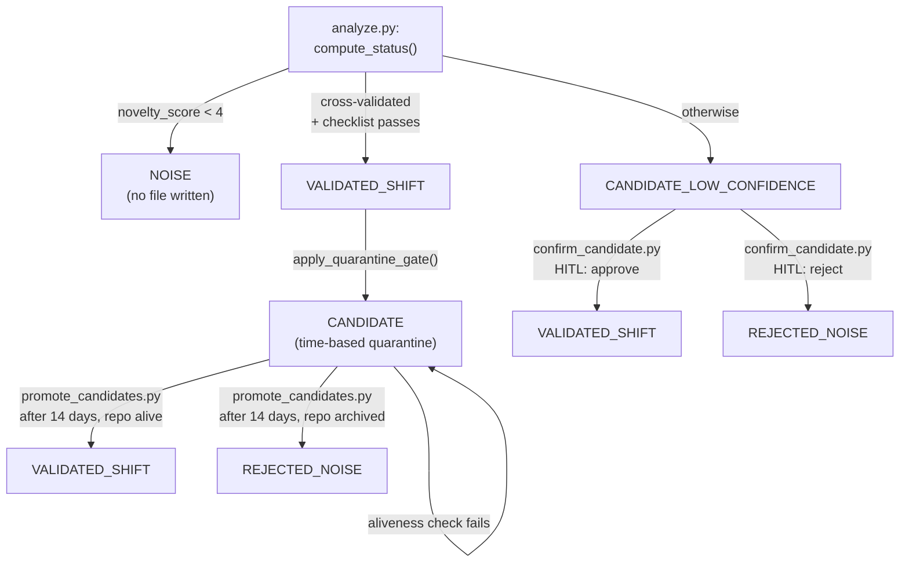

# Architecture

README explains what Radar does and how to run it — understood in 30
seconds, for a developer landing on the repo. This document answers a
different question, for a slower read: **why does this pattern work as
a measuring instrument**, not a generator of plausible-sounding text?
Every claim below points at a real function or file — check it in one
click.

Radar's implementation is domain-specific (AI/agentic-tooling-market
signal detection). The claim that its *pattern* generalizes to other
domains is an architectural claim, not a code claim — see "Why the
pattern generalizes" below.

## The five layers

```
Layer 0 → Sources       GitHub / HN / Reddit / AwesomeLists
Layer 1 → Signals       repositories, articles, posts
Layer 2 → Assessment    SHIFT / NOISE  (analyze.py via Haiku)
Layer 3 → Patterns      signal clusters (patterns.py via Sonnet)
Layer 4 → Meta          our patterns + ExternalAnalyst[] (Forecasts: planned, not implemented)
```

- **Layer 0-1**: `src/radar_step0.py` collects, `src/filter.py` cuts
  the volume down with a keyword + traction check before anything
  reaches an LLM. `src/scorecard.py` feeds the traction check with an
  OpenSSF Scorecard lookup — a third-party signal, not a self-report.
- **Layer 2**: `src/analyze.py`. Every candidate gets a Maturity ×
  Novelty classification plus a CoVe (Chain-of-Verification) self-check
  — see below for why this specific mechanism, not just "ask the model
  to double-check itself".
- **Layer 3**: `src/patterns.py` clusters confirmed assessments into
  patterns and runs falsification on existing patterns on the same
  pass (see "The falsification loop" below).
- **Layer 4**: external analysts (`src/fetch_analysts.py`) are a
  second, independent input into pattern clustering — `patterns.py`
  looks for where our signal and external analyst opinion align,
  where we see something they don't, and vice versa. `Forecasts` is
  named in the diagram above as a stated direction, not a built
  feature — see Roadmap.

## Why this is a measuring instrument, not a plausible-text generator

A system that asks an LLM "is this a real shift?" and prints whatever
it says back is a text generator with extra steps — its output is only
as trustworthy as the model's mood that day, unfalsifiable, and prone
to the exact failure class where the model's own reasoning and its
final verdict quietly diverge. Radar is built specifically against
that failure mode, in three structural ways:

**1. The verdict is decided by code, not by the model's self-report.**
`compute_status()` (`src/analyze.py:211`) takes the model's structured
output — `novelty_score`, `cross_validation_confirmed`,
`novelty_checklist_passes` — and computes the status itself:

```python
def compute_status(novelty_score, cross_validation_confirmed, novelty_checklist_passes):
    """Финальный status определяется кодом, не самоотчётом модели - CoVe существует
    именно затем, чтобы reasoning и итоговый вердикт не могли молча разойтись
    (инцидент qyvaria-hardlogic-kernel-engine)."""
    if novelty_score < 4:
        return None  # NOISE - no file is created at all
    if cross_validation_confirmed and novelty_checklist_passes:
        return "VALIDATED_SHIFT"
    return "CANDIDATE_LOW_CONFIDENCE"
```

The docstring names a real incident (`qyvaria-hardlogic-kernel-engine`)
that motivated this design: a case where a model's stated reasoning and
its final verdict disagreed, and nothing in the pipeline caught it. CoVe
(Chain-of-Verification) exists specifically to make that divergence
structurally impossible — the model can't just assert a verdict, its
own verification fields are what code branches on. Below `novelty_score
4`, no file is written at all — NOISE isn't a status the model can
argue its way out of, it's the pipeline stopping.

**2. Publication readiness is a separate question from verdict
correctness — a two-gate quarantine.**

`apply_quarantine_gate()` (`src/analyze.py:222`) never lets a fresh
`VALIDATED_SHIFT` publish directly:

```python
def apply_quarantine_gate(verdict):
    """Новый подтверждённый вердикт уходит в time-based карантин (status CANDIDATE),
    не публикуется как VALIDATED_SHIFT напрямую - evidence_log на этом call site всегда
    пуст (новый файл), решение зафиксировано в интервью 05.08.2026 (SPEC.md). Вердикт
    и готовность к публикации - разные понятия, поэтому это отдельная проверка, а не
    часть compute_status()."""
    return "CANDIDATE" if verdict == "VALIDATED_SHIFT" else verdict
```

This produces two structurally different "not yet trusted" states,
resolved by different mechanisms — `confidence_label()`
(`src/analyze.py:231`) exists specifically to keep them from being
read as the same thing:

- **`CANDIDATE`** — the model was confident, but the verdict is young.
  Resolved automatically: `src/promote_candidates.py` waits
  `QUARANTINE_DAYS = 14`, then re-checks the repository is still alive
  (`check_repo_alive()`) before promoting to `VALIDATED_SHIFT`, or
  drops it to `REJECTED_NOISE` if the repo went dark in the meantime.
  If the aliveness check itself fails, the file stays `CANDIDATE` and
  is retried on the next run — never silently promoted on missing data.
- **`CANDIDATE_LOW_CONFIDENCE`** — the model itself wasn't confident.
  This never resolves automatically. `src/confirm_candidate.py` is a
  human-in-the-loop gate: it only accepts input when the file's status
  is exactly `CANDIDATE_LOW_CONFIDENCE`, and turns an explicit
  `approve`/`reject` decision into `VALIDATED_SHIFT` or
  `REJECTED_NOISE`. Time alone never resolves an epistemic gate.



**3. Published verdicts are not write-once — there's a falsification
loop.** `src/patterns.py` (`should_falsify()`, `falsify_pattern()`,
`run_falsification()`, lines 667/690/777) re-examines existing patterns
on every weekly run, not just new assessments. Separately,
`src/recheck_lifecycle.py` re-checks already-`VALIDATED_SHIFT`
assessments for staleness: `FROZEN_MONTHS = 6` (no repo activity) and
`RELEASES_STOPPED_MONTHS = 12` (no releases) — a verdict that was
correct at publication time isn't assumed to stay correct forever.

## What's implemented vs planned

| Implemented (real, in code) | Planned (not in code) |
|---|---|
| Layers 0-3 (Sources → Signals → Assessment → Patterns) | Layer 4's `Forecasts` |
| Layer 4's external-analyst input (`fetch_analysts.py`) | `Decisions`, `Outcomes` |
| CoVe self-check, code-decided verdict | `Observability` layer |
| Two-gate quarantine (time-based + epistemic/HITL) | `Trust & Security` layer |
| Pattern falsification + assessment lifecycle recheck | `Optimization` layer |

## Why the pattern generalizes

The claim here is about the *pattern* —
detecting-and-verifying-signals-from-noise, with a CoVe-checked verdict
and a two-gate quarantine before anything is trusted — not about the
current code being reusable out of the box. Retargeting Radar at a
different domain today means manually rewriting filter keywords and
prompts; there's no domain-configuration layer. README's "Emergent
properties" section already lists concrete examples of what that
retargeting could look like (a biotech/policy/legal/VC-deals research
assistant, internal competitive intelligence over Confluence/Jira/Slack,
a domain-swapped newsletter generator) — see there for detail rather
than repeating it here.

## Roadmap

- **Forecasts** — probabilistic pattern-trajectory projections, layered
  on top of the existing pattern/falsification data.
- **Decisions** — a structured record of owner decisions made in
  response to patterns, closing the loop from signal to action.
- **Outcomes** — tracking what actually happened after a Decision, to
  measure the pipeline's real-world hit rate.
- **Observability** — operational visibility into the pipeline's own
  health, beyond the current Telegram failure notifications.
- **Trust & Security** — a gated layer for provenance and integrity
  checks on external signal sources themselves.
- **Optimization** — tuning thresholds (`novelty_score`, quarantine
  length, trust weights) against observed outcome data instead of
  fixed constants.
