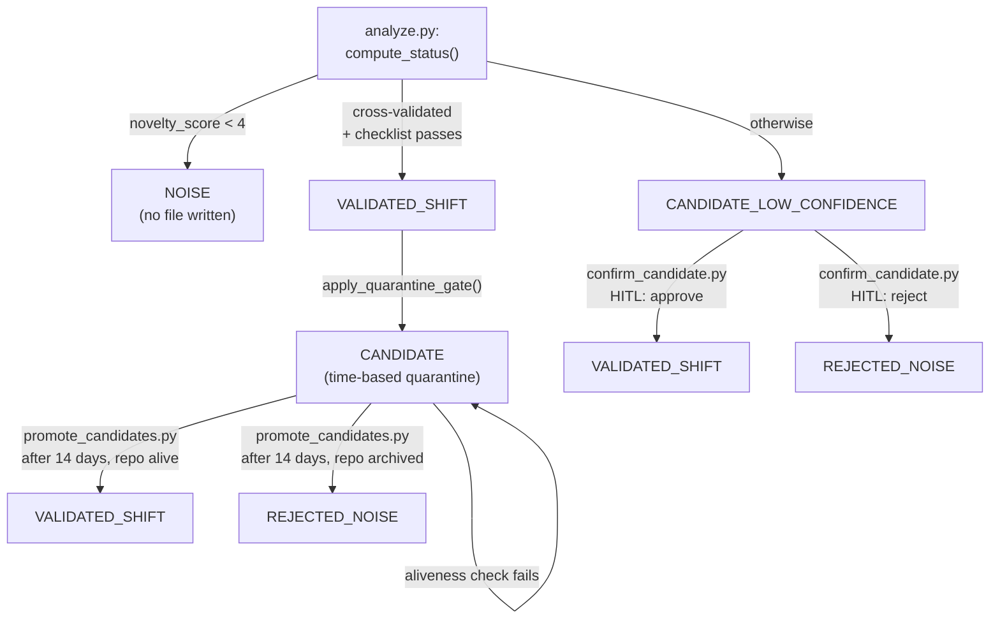

# Architecture

README explains what Radar does and how to run it — understood in 30
seconds, for a developer landing on the repo. This document answers a
different question, for a slower read: **why does this pattern work as
a measuring instrument**, not a generator of plausible-sounding text —
and what shape the system is in right now. Every claim below points at
a real function, file, or commit — check it in one click. Where a
decision explains *why* the system looks this way, this document links
to the ADR that owns it rather than re-arguing the decision here.

Radar's implementation is domain-specific (AI/agentic-tooling-market
signal detection). The claim that its *pattern* generalizes to other
domains is an architectural claim, not a code claim — see "Why the
pattern generalizes" below.

## The five layers

```
Layer 0 → Sources       GitHub / HN / Reddit / AwesomeLists
Layer 1 → Signals       repositories, articles, posts
Layer 2 → Assessment    2D Maturity×Novelty matrix + CoVe  (analyze.py via Haiku)
Layer 3 → Patterns      signal clusters (patterns.py via Sonnet)
Layer 4 → Meta          our patterns + ExternalAnalyst[] (Forecasts: planned, not implemented)
```

- **Layer 0-1**: `src/radar_step0.py` collects, `src/filter.py` cuts
  the volume down with a keyword + traction check before anything
  reaches an LLM. `src/scorecard.py` feeds the traction check with an
  OpenSSF Scorecard lookup — a third-party signal, not a self-report.
- **Layer 2**: `src/analyze.py`. Every candidate gets a Maturity ×
  Novelty classification plus a CoVe (Chain-of-Verification) self-check
  (ADR-0003) — see below for why this specific mechanism, not just "ask
  the model to double-check itself". A separate `state_value` axis
  (ADR-0004) tracks lifecycle trend/momentum independently of this
  maturity snapshot.
- **Layer 3**: `src/patterns.py` clusters confirmed assessments into
  patterns and runs falsification on existing patterns on the same
  pass (see "The falsification loop" below, ADR-0006).
- **Layer 4**: external analysts (`src/fetch_analysts.py`) are a
  second, independent input into pattern clustering — `patterns.py`
  looks for where our signal and external analyst opinion align,
  where we see something they don't, and vice versa. `Forecasts` is
  named in the diagram above as a stated direction, not a built
  feature — see `docs/ROADMAP.md`.

Planned layers, not part of the current working architecture, introduced
only under an explicit trigger from data: `Forecasts`, `Decisions`,
`Outcomes`, `Feedback` (first step already taken —
`check_model_updates.py`). Planned gated layers: `Observability`,
`Trust & Security`, `Optimization & Evolution`.

## Platform: GitHub only (migrated 2026-08-25)

The full GitLab-to-GitHub migration is owned by ADR-0013 — this section
describes the resulting shape, not the decision itself.

`github.com/mikkiola/radar`, public, MIT license. Branches: `main`
(default, protected — Maintainers push/merge, no force push), `vault`
(not protected at this time — see Known Technical Debt below).
Ruleset `main` is active (Restrict updates/deletions, Block force
pushes, bypass = Repository admin) — renamed from the old
`master`-era ruleset from the GitHub-mirroring period, not recreated
from scratch.

`master` was renamed to `main` on both platforms as a first step,
before the source-of-truth switch — a new branch created from the same
commit, not an in-place rename, preserving the project's
create-alongside-don't-mutate-until-confirmed pattern. Affected spots,
found by full recon rather than assumption: `.gitlab-ci.yml` (3
hardcoded references to the branch name — `git clone --branch`, a
`$CI_COMMIT_BRANCH` condition, and the Telegram-notification text),
`README.md` (3 mentions), the GitHub push-mirror Ruleset (already
existed under the name `master`, renamed and retargeted to `main`),
GitLab Protected Branches (`main` protected under the same
Maintainers/Maintainers scheme as `master`), and GitHub Branch
protection (same). GitLab's and GitHub's default branches were switched
to `main` only after `main` already carried the fixed CI config — order
matters here, otherwise a new push to the default branch would have run
against a CI file still referencing the old name.

`master` was deleted on both platforms only after full parity was
confirmed (SHAs identical). `vault` moved to GitHub as a full branch —
not through the old push-mirror mechanism, which only ever covered
protected branches — `git checkout -b vault origin/vault` + `git push
github vault:vault`, full history preserved (1879 objects, including
parent commits), SHA confirmed identical on both platforms before
GitLab deletion: `39286a667923f64418b08942df926f6ca23571c3`.

Publishing `vault` publicly on GitHub (rather than leaving it
private/unmirrored, as had been left open since 2026-08-07) is owned by
ADR-0014.

**Operational error found and fixed: confused git remotes.** The local
clone on the owner's machine had both `origin` (GitLab) and `github`
(GitHub, added mid-session for the vault transfer) configured at once.
Several `git push origin main` commands in a row (branch rename,
workflow-file creation, README edits) went to GitLab, not GitHub — the
old GitLab→GitHub push-mirror (SPEC C / ADR-0011's mechanism, limited to
protected branches) either didn't pick these commits up or was already
moot given the same-session source-of-truth reversal. Found by direct
check, not assumption: `.github/workflows/` returned 404 via the public
GitHub API while `git log` locally showed the commits as present. Fixed
with a direct `git push github main:main` — GitHub logged "Bypassed
rule violations for refs/heads/main: Cannot update this protected ref",
meaning the push went through via the owner's admin bypass on the
Ruleset, not because protection was absent.

## CI/CD: GitHub Actions

`.gitlab-ci.yml` was removed from the repository entirely (277 lines,
commit `fd6e8b4`) — not left as a dead artifact. All 13 former GitLab
jobs became 9 `.github/workflows/*.yml` files plus 1 composite action.

### Composite action: vault-write

`.github/actions/vault-write/action.yml` encapsulates the pattern 7 of
the 13 original jobs implemented by hand: `git add -A` → if no diff,
no-op message and exit → otherwise commit → `git pull --rebase origin
vault` → `check_frontmatter.py` as a gate → `git push origin vault`.
Removes roughly 15 lines of duplicated bash from each of those 7 call
sites into one reusable unit, parameterized by commit message, no-op
message, and frontmatter-check path.

### Workflow files

| File | Job(s) | Schedule (UTC) | Manual trigger |
|---|---|---|---|
| security.yml | security_secrets, security_deps | daily 22:00 | yes |
| test.yml | test | — (push to main) | no |
| daily-run.yml | radar, promote_candidates, recheck_lifecycle | daily 22:00 | yes (inputs lifecycle_only/promote_only) |
| monthly-lifecycle.yml | recheck_lifecycle | 1st of month, 17:00 | yes |
| weekly-patterns.yml | analysts, check_models, patterns | Thursday 22:00 | yes |
| publish.yml | publish | 02:00 and 14:00 daily | yes |
| lint-vault.yml | lint_vault | daily 22:00 | yes |
| confirm-candidate.yml | confirm_candidate | — | yes (inputs confirm_repo/confirm_decision) |
| pages.yml | build, deploy | — (push to main or vault) | yes |

`patterns` depends on `analysts` and `check_models` via `needs:` in
`weekly-patterns.yml` — preserves the same execution order the old
GitLab stages (`collect` → `patterns`) enforced, expressed through
GitHub Actions' native mechanism rather than a stage analogue.

Schedules were recalculated from Asia/Bangkok (previously set in the
GitLab UI's Pipeline Schedules, not in a file) to UTC — a fixed −7 hour
shift, since GitHub Actions cron doesn't support timezones. One
approximation: `monthly-lifecycle.yml` uses `0 17 1 * *` instead of the
exact "00:00 Bangkok on the 1st" — cron can't natively express "last
day of the previous month," and the sub-day difference was judged
immaterial for a monthly check.

### Secrets: rebuilt from scratch, not migrated

All 6 secrets (`ANTHROPIC_API_KEY`, `GH_READ_TOKEN`,
`GH_VAULT_PUSH_TOKEN`, `TELEGRAM_BOT_TOKEN`, `TELEGRAM_CHANNEL_ID`,
`TELEGRAM_OWNER_ID`) were created fresh in GitHub Actions Secrets, none
copied from GitLab CI/CD Variables. Reason: a real leak, not a
hypothetical risk — GitLab's `/variables` API endpoint, called with a
sufficiently-scoped (`api`) token during an unrelated diagnostic,
returned all 6 values in plaintext. `masked: true` in GitLab only
protects job-log output, not the API response itself.

`GITHUB_READ_TOKEN` was renamed to `GH_READ_TOKEN` — GitHub reserves the
`GITHUB_` prefix for its own system variables and rejects a secret name
starting with it.

`vault-write` and `pages.yml`'s auto-trigger on vault pushes use a
dedicated PAT (`GH_VAULT_PUSH_TOKEN`), not the built-in `GITHUB_TOKEN` —
events from the built-in token deliberately don't cascade further
workflow runs (GitHub's anti-loop protection), and `pages.yml` needs to
react to pushes on both `main` and `vault`.

## GitHub Pages

Source is set to "GitHub Actions" (Settings → Pages) — was "Deploy from
a branch" (disabled) by default for a new repository. URL confirmed by
fact: `https://mikkiola.github.io/radar/`.

The first and, as of this writing, only successful `pages.yml` run —
2026-08-25T13:23:40Z — had both the `build` and `deploy` jobs succeed;
the site works substantively (home page, Patterns/Assessments sections
with all 14 migrated patterns render correctly).

**Known open defect: the interactive graph doesn't render.** Browser
console shows `Failed to load resource: 404` on
`assets/javascripts/graph.json`, followed by `SyntaxError: Unexpected
token '<'` (the server returned a 404 HTML page instead of JSON).
Line-by-line verification found no path mismatch:
`src/generate_graph.py` writes to
`docs/assets/javascripts/graph.json` (via `DOCS_DIR`, matching
`mkdocs.yml`'s `docs_dir`), `docs/assets/javascripts/interactive_graph.js`
requests `/assets/javascripts/graph.json` (site-root-absolute) — both
point at the same file in the built `public/` output. The one
successful run completed cleanly, with no build-step errors. Most
likely explanation (not confirmed by a repeat check within this
session): the 404 was observed before the one successful deploy
finished (at a point when `.github/workflows/` didn't yet physically
exist on GitHub, due to the confused-remotes issue above) — but a
repeat check with a hard browser cache clear still showed the same
error after the confirmed-successful deploy. Open item, tracked in
`docs/BACKLOG.md`.

## Acceptance verification without a token

Unchanged mechanism: the public GitHub API (no token, repository is
public) — used repeatedly through the migration session to cross-check
branch SHAs, workflow state, and file contents. The equivalent
mechanism on the GitLab side is no longer applicable — that repository
is gone.

## Data flow

GitHub/HN/Reddit/AwesomeLists → `radar_step0.py` → `filter.py` →
`analyze.py` → `compute_status()` → `apply_quarantine_gate()` →
security/test stages → `01_Assessments/` →
`promote_candidates`/`recheck_lifecycle` → `patterns.py` →
`02_Patterns/` → HITL → Telegram channel. All paths go through
`VAULT_ROOT` (ADR-0008). GitHub Actions runners use `python:3.12` via
`actions/setup-python`. One GitHub repository, branches `main`
(scripts) and `vault` (data).

## Why this is a measuring instrument, not a plausible-text generator

A system that asks an LLM "is this a real shift?" and prints whatever
it says back is a text generator with extra steps — its output is only
as trustworthy as the model's mood that day, unfalsifiable, and prone
to the exact failure class where the model's own reasoning and its
final verdict quietly diverge. Radar is built specifically against
that failure mode, in three structural ways:

**1. The verdict is decided by code, not by the model's self-report**
(ADR-0003). `compute_status()` (`src/analyze.py:211`) takes the
model's structured output — `novelty_score`, `cross_validation_confirmed`,
`novelty_checklist_passes` — and computes the status itself:

```python
def compute_status(novelty_score, cross_validation_confirmed, novelty_checklist_passes):
    """Финальный status определяется кодом, не самоотчётом модели - CoVe существует
    именно затем, чтобы reasoning и итоговый вердикт не могли молча разойтись
    (инцидент qyvaria-hardlogic-kernel-engine)."""
    if novelty_score < 4:
        return None  # NOISE - no file is created at all
    if cross_validation_confirmed and novelty_checklist_passes:
        return "VALIDATED_SHIFT"
    return "CANDIDATE_LOW_CONFIDENCE"
```

The docstring names a real incident (`qyvaria-hardlogic-kernel-engine`)
that motivated this design: a case where a model's stated reasoning and
its final verdict disagreed, and nothing in the pipeline caught it. CoVe
(Chain-of-Verification) exists specifically to make that divergence
structurally impossible — the model can't just assert a verdict, its
own verification fields are what code branches on. Below `novelty_score
4`, no file is written at all — NOISE isn't a status the model can
argue its way out of, it's the pipeline stopping.

**2. Publication readiness is a separate question from verdict
correctness — a two-gate quarantine** (ADR-0005).

`apply_quarantine_gate()` (`src/analyze.py:222`) never lets a fresh
`VALIDATED_SHIFT` publish directly:

```python
def apply_quarantine_gate(verdict):
    """Новый подтверждённый вердикт уходит в time-based карантин (status CANDIDATE),
    не публикуется как VALIDATED_SHIFT напрямую - evidence_log на этом call site всегда
    пуст (новый файл), решение зафиксировано в интервью 05.08.2026 (SPEC.md). Вердикт
    и готовность к публикации - разные понятия, поэтому это отдельная проверка, а не
    часть compute_status()."""
    return "CANDIDATE" if verdict == "VALIDATED_SHIFT" else verdict
```

This produces two structurally different "not yet trusted" states,
resolved by different mechanisms — `confidence_label()`
(`src/analyze.py:231`) exists specifically to keep them from being
read as the same thing:

- **`CANDIDATE`** — the model was confident, but the verdict is young.
  Resolved automatically: `src/promote_candidates.py` waits
  `QUARANTINE_DAYS = 14`, then re-checks the repository is still alive
  (`check_repo_alive()`) before promoting to `VALIDATED_SHIFT`, or
  drops it to `REJECTED_NOISE` if the repo went dark in the meantime.
  If the aliveness check itself fails, the file stays `CANDIDATE` and
  is retried on the next run — never silently promoted on missing data.
- **`CANDIDATE_LOW_CONFIDENCE`** — the model itself wasn't confident.
  This never resolves automatically. `src/confirm_candidate.py` is a
  human-in-the-loop gate: it only accepts input when the file's status
  is exactly `CANDIDATE_LOW_CONFIDENCE`, and turns an explicit
  `approve`/`reject` decision into `VALIDATED_SHIFT` or
  `REJECTED_NOISE`. Time alone never resolves an epistemic gate.



**3. Published verdicts are not write-once — there's a falsification
loop** (ADR-0006). `src/patterns.py` (`should_falsify()`,
`falsify_pattern()`, `run_falsification()`, lines 667/690/777)
re-examines existing patterns on every weekly run, not just new
assessments. Separately, `src/recheck_lifecycle.py` re-checks already-
`VALIDATED_SHIFT` assessments for staleness: `FROZEN_MONTHS = 6` (no
repo activity) and `RELEASES_STOPPED_MONTHS = 12` (no releases) — a
verdict that was correct at publication time isn't assumed to stay
correct forever.

## What's implemented vs planned

| Implemented (real, in code) | Planned (not in code) |
|---|---|
| Layers 0-3 (Sources → Signals → Assessment → Patterns) | Layer 4's `Forecasts` |
| Layer 4's external-analyst input (`fetch_analysts.py`) | `Decisions`, `Outcomes` |
| CoVe self-check, code-decided verdict (ADR-0003) | `Observability` layer |
| `state_value` lifecycle axis (ADR-0004) | `Trust & Security` layer |
| Two-gate quarantine, time-based + epistemic/HITL (ADR-0005) | `Optimization` layer |
| Pattern falsification + assessment lifecycle recheck (ADR-0006) | |
| GitHub Actions CI/CD, GitHub Pages (ADR-0013) | |

## Why the pattern generalizes

The claim here is about the *pattern* —
detecting-and-verifying-signals-from-noise, with a CoVe-checked verdict
and a two-gate quarantine before anything is trusted — not about the
current code being reusable out of the box. Retargeting Radar at a
different domain today means manually rewriting filter keywords and
prompts; there's no domain-configuration layer. README's "Emergent
properties" section already lists concrete examples of what that
retargeting could look like (a biotech/policy/legal/VC-deals research
assistant, internal competitive intelligence over Confluence/Jira/Slack,
a domain-swapped newsletter generator) — see there for detail rather
than repeating it here.

## Process: MR and merge

Unchanged. The only real MR in the project's history is SPEC A
(ADR-0007). Every later change, including the entire GitLab-to-GitHub
migration (ADR-0013), was a direct commit with no MR and no feature
branch — the volume and character of those changes stayed under SPEC
A's architectural threshold despite the migration's overall scope,
because each individual commit was targeted and reversible.

## Known technical debt

- **The interactive graph doesn't render on GitHub Pages** (404 on
  `graph.json`) — see GitHub Pages section above. Tracked in
  `docs/BACKLOG.md`.
- **`vault` branch protection is not configured on the GitHub side** —
  `vault` was only protected on GitLab as a technical prerequisite for
  the old mirroring filter; whether it needs protection on GitHub on
  its own merits hasn't been decided. Tracked in `docs/BACKLOG.md`.
- `update_assessments.py`/`recheck_lifecycle.py` race condition on the
  shared vault file — unchanged, not addressed. Tracked in
  `docs/BACKLOG.md`.
- Leftover empty directory `gitlab.com/lyolich777ka/` at the repository
  root — found 2026-08-06; relevance after the platform change dropped
  along with the whole GitLab repository if the directory was specific
  to GitLab's own on-disk path structure, not explicitly checked.
  Tracked in `docs/BACKLOG.md`.
- `vault` branch public/private — **resolved, ADR-0014: `vault` is
  published publicly.** No longer an open BACKLOG item.
- Timeout unification — undecided, unchanged.
- GitHub API retry logic — undecided, unchanged.
- Renewal of the old GitHub PAT `radar-mirror-push` (was set to expire
  2027-08-07) — **moot**: the entire secrets set was rebuilt from
  scratch 2026-08-25; the old PAT belonged to the now-gone push-mirror
  mechanism.
- The CI job table in README, kept separate from the main CI/CD
  section, was updated following the GitHub Actions structural switch
  (two follow-up commits, `7b2cb04` and `6a5114b`), removing leftover
  GitLab stage terminology.

---

Updated: 2026-08-25 (full platform migration: master→main rename on
GitLab and GitHub, source-of-truth reversal GitLab→GitHub, vault moved
with full history, 13 GitLab CI jobs became 9 GitHub Actions workflow
files plus 1 composite action, all 6 secrets rebuilt from scratch after
a leak found via the GitLab API, GitHub Pages configured and working
except for the known graph.json defect, GitLab repository deleted; a
confused-git-remotes operational error was found and documented).
Source: session 2026-08-25 (ARCHITECTURE_r v2.5), merged with this
repository's existing ARCHITECTURE.md (SPEC D / ADR-0012, code
references re-verified against current `src/` before merge) and
cross-referenced against ADR-0001 through ADR-0014.
